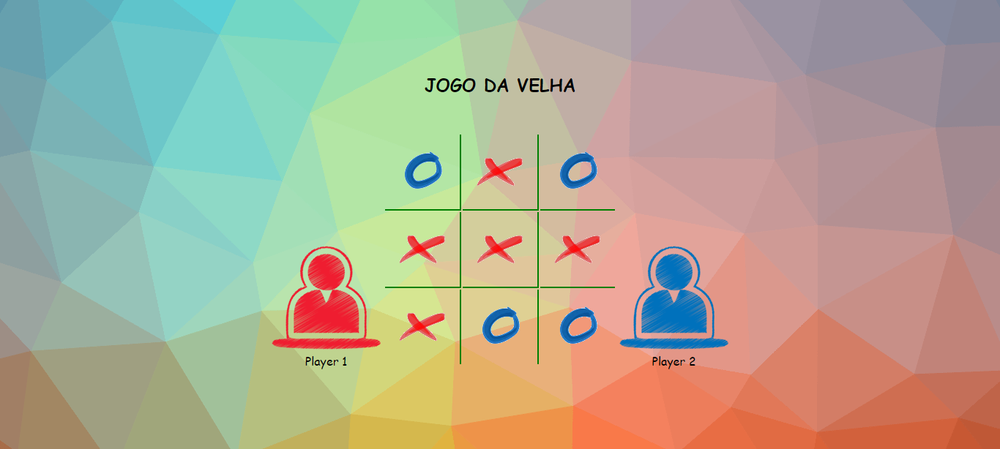

# Jogo da Velha
Jogo desenvolvido em uma atividade sobre JavaScript. Onde teriamos que desenvolver alguma aplicação web usando HTML, CSS e JavaScript.
 
## 📱 Estado Atual

<code>

</code>

 
## 📌 Contatos!
- Instagram: https://www.instagram.com/marcelojjunior_/
- Github: https://github.com/marcelojjunior